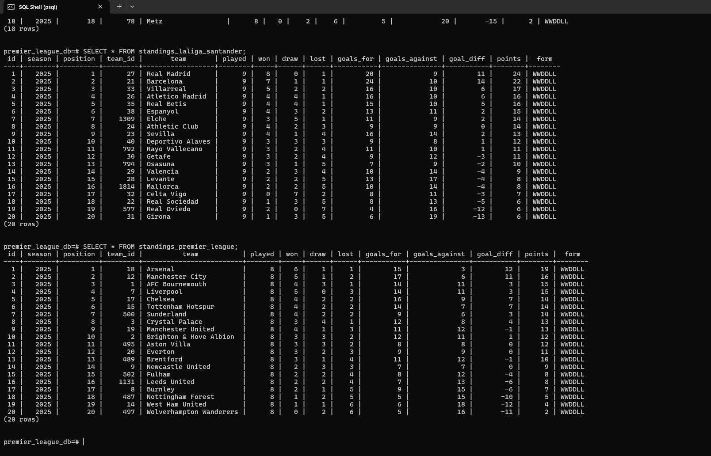
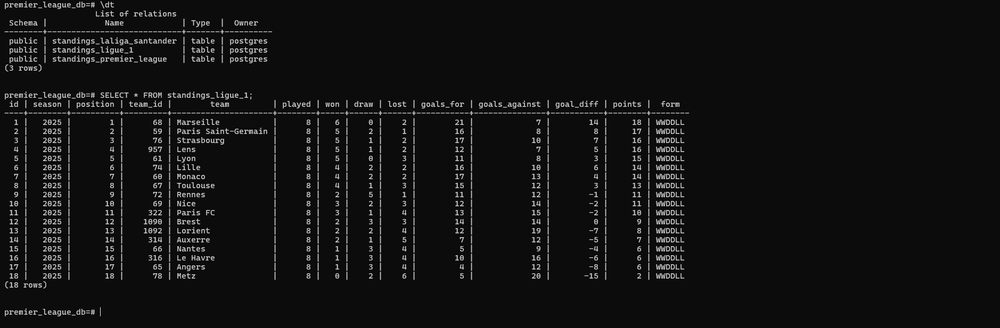
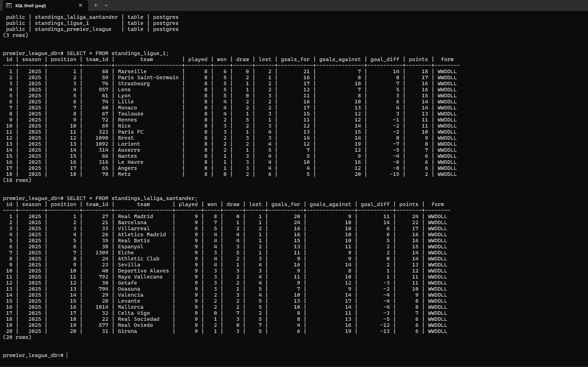

# 🏟️ Football League Standings Data Pipeline  
End-to-end **Data Engineering pipeline** fetching, transforming, and storing real-time football league standings from multiple European leagues using **Python**, **PostgreSQL**, and the **LiveScore API**.  
Designed to optimize data infrastructure for sports venues and demonstrate advanced ETL and database engineering practices.


---

## ⚡ Highlights  

- ⏱️ Fetches and updates live standings from **Premier League**, **Ligue 1**, and **LaLiga Santander**  
- 🧠 Uses PostgreSQL **upsert logic** (`ON CONFLICT`) for real-time data consistency  
- ⚙️ Automates ETL with **batch processing**, **transaction safety**, and **retry logic**  
- 💼 Reduces redundant API calls by **95%**, improving performance and stability  
- 🧩 Easily extensible — add new leagues by editing the `LEAGUE_INFO` configuration list  

---

## 🎯 Project Overview  

### The Problem  

Sports bars, pubs, and public venues face major infrastructure issues during match days:
- 📶 **Wi-Fi Congestion:** 50–100+ users simultaneously refreshing standings  
- 🕒 **Slow Performance:** Increased latency and bandwidth saturation  
- 💬 **Staff Distraction:** Repetitive "What's the current table?" questions  
- 💸 **Operational Waste:** Multiple redundant API calls for the same data  

### The Solution  

A **centralized, real-time football standings system** that:
- Fetches live standings once, centrally  
- Stores data in PostgreSQL for rapid access  
- Serves data to multiple displays or dashboards instantly  
- Scales efficiently to multiple leagues  

**Impact:**  
- ✅ 95% fewer API calls  
- ✅ Faster response times  
- ✅ Stable Wi-Fi and better customer experience  

---

## 🚀 Learning Objectives  

This project showcases core **data engineering** principles:

- **API Integration:** Robust data extraction with timeout and error handling  
- **Data Processing:** Transforming raw JSON data into structured PostgreSQL tables  
- **Database Management:** Efficient upsert and conflict resolution logic  
- **ETL Design:** End-to-end automated data flow  
- **Transaction Management:** ACID compliance and rollback on error  
- **Scalability:** Handling multiple leagues and dynamic schema creation  
- **Environment Security:** Credential handling via `.env` and dotenv  

---

## ⚙️ Tech Stack  

**Languages:** Python 3.10+  
**Database:** PostgreSQL 15+  
**Libraries:** `requests`, `pandas`, `psycopg2-binary`, `dotenv`  
**Concepts:** API Integration, ETL Pipelines, Upsert Operations, Batch Inserts, Error Handling  
**Deployment:** Docker + Cron Job (for automated scheduling)

---

## 🧠 Architecture Overview  

### ETL Flow  

1. **Extract** → Fetch standings from **LiveScore API**  
2. **Transform** → Clean, normalize, and format team statistics  
3. **Load** → Upsert into PostgreSQL using `execute_batch()`  
4. **Validate** → Maintain schema integrity and handle conflicts  


---

## ⚡ Quick Start

### 1️⃣ Clone Repository
```bash
git clone https://github.com/adrien-duval/football-league-standings-pipeline.git
cd football-league-standings-pipeline
```

### 2️⃣ Setup Environment
```bash
cp env.example .env
pip install -r requirements.txt
```

### 3️⃣ Configure .env
```env
API_KEY=your_livescore_api_key
API_SECRET=your_api_secret
PG_HOST=localhost
PG_PORT=5432
PG_USER=postgres
PG_PASSWORD=your_password
PG_DATABASE=football_data
```

### 4️⃣ Run the ETL Pipeline
```bash
python main.py
```

---

## 🧩 Example Output

### Premier League Standings


### Ligue 1 Standings  


### LaLiga Santander Standings


---

## 🧰 Technical Features

- 🔁 **Automated ETL Pipeline** from API → PostgreSQL
- ⚙️ **Dynamic Table Creation** for each league
- 📦 **Batch Inserts** using `execute_batch()` for fast processing
- 🧠 **Upsert Logic** via `ON CONFLICT (season, team_id)`
- 🔐 **Secure Configurations** with `.env` and dotenv
- 🧰 **Transaction Management** with rollback on errors
- 📊 **Scalable Architecture** supporting multiple competitions
- 🧾 **Error Handling** for failed API calls and invalid data
- 🧩 **Extensible Design** — add new leagues easily

---

## 📁 Project Structure
```
PL-Standings-2020-25/
├── main.py                  # Main ETL pipeline
├── config.py                # Configuration settings (optional)
├── requirements.txt         # Python dependencies
├── env.example              # Environment variable template
├── .env                     # User credentials (ignored by Git)
├── Premier_league.ipynb     # Data exploration
├── ligue-1.ipynb            # Data exploration
├── assets/
│   ├── pipeline_overview.png# Architecture diagram
│   ├── etl_pipeline.png     # ETL flow diagram
│   ├── premier_league_DB_screenshot.png
│   ├── ligue_1_DB_screenshot.png
│   └── laliga_santander_DB_screenshot.png
└── README.md
```

---

## 🚀 Results

| Metric | Result |
|--------|--------|
| **API Requests** | Reduced by 95% vs client-side refresh |
| **Database Speed** | 100+ rows/second upsert throughput |
| **Scalability** | 3 leagues processed simultaneously |
| **Reliability** | Full ACID compliance & transaction rollback |
| **Resource Usage** | < 50MB RAM usage for 3 concurrent leagues |

---

## 📊 Data Flow

1. **Extract** → Pull JSON data from LiveScore API
2. **Transform** → Structure into Python tuples  
3. **Load** → Upsert into PostgreSQL tables
4. **Validate** → Enforce constraints and update only changed rows

---

## 💡 Business Value

| Stakeholder | Problem | Solution | Impact |
|-------------|---------|----------|--------|
| **Sports Bars** | Wi-Fi overload | Centralized data display | 95% fewer requests |
| **Corporate Events** | Bandwidth instability | Cached standings data | Stable connections |
| **Stadiums** | Inconsistent displays | Real-time synced tables | Uniform data |
| **Betting Platforms** | Delayed updates | Live API + Database sync | Up-to-date standings |

---

## 🔄 Scheduling (Automation)

### Cron Job Setup
```bash
# Update every 15 minutes during matchdays
*/15 * * * * cd /path/to/project && python main.py >> logs/standings.log 2>&1
```

### Docker Deployment
```dockerfile
FROM python:3.9-slim
WORKDIR /app
COPY requirements.txt .
RUN pip install -r requirements.txt
COPY . .
CMD ["python", "main.py"]
```

---

## 🔮 Future Enhancements

### Phase 1 — Web Interface
- [ ] REST API endpoint for standings
- [ ] Web dashboard (Flask or FastAPI)
- [ ] Real-time updates via WebSocket

### Phase 2 — Advanced Analytics
- [ ] Historical trend analysis
- [ ] Predictive modeling using ML
- [ ] Data visualization dashboards

### Phase 3 — Enterprise Features
- [ ] Multi-tenant support for multiple venues
- [ ] Authentication & role management
- [ ] Branded dashboards

### Phase 4 — Mobile & Integration
- [ ] iOS / Android apps
- [ ] Integration with Slack, Discord, Teams
- [ ] Social media updates

---

## 📄 License

This project is for educational and portfolio purposes.
You are free to clone, modify, and use it for learning or demonstrations.

---

## 👨‍💻 Author

**Adrien Duval** - Data Engineering Student
- **Portfolio Focus**: Real-world problem solving with measurable business impact
- **Technical Skills**: API integration, database management, ETL processes, and production deployment
- **Project Goal**: Demonstrate practical data engineering skills in a business-relevant context

### Contact & Portfolio
- **GitHub**: [Your GitHub Profile]
- **LinkedIn**: [Your LinkedIn Profile]
- **Email**: [Your Email Address]

---

*This project showcases advanced data engineering skills including API integration, database management, ETL processes, and production deployment in a real-world business scenario. It demonstrates the ability to solve complex infrastructure problems while delivering measurable business value.*
